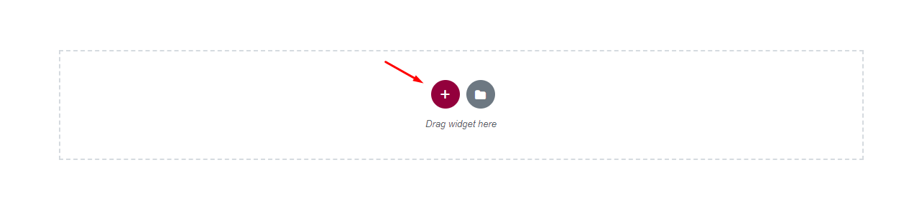

# Set up Homepage

You can quickly build a home page using Elementor for WordPress which is a drag and drop frontend and backend page builder plugin that will save you tons of time working on the site content. You will be able to take full control over your WordPress site, and build any layout you can imagine – no programming knowledge required.

From your **Dashboard** admin Navigate to **Pages.**

&#x20;\- Select **All Pages** to see all pages then click edit one page you want.

&#x20;\- Select **Add New** to create the new page.

One page always includes a lot of parts like the Header, Main Page, Widget Sidebar, and Footer. In that section, we guide you to create the Main page by using Elementor.

## **1. How to use**&#x20;

Have you ever used Elementor? Please follow that guide first: [**Elementor guide**](https://docs.elementor.com/)​

​[Official Plugin Documentation](https://elementor.com/) For More information about the Elementor check the official documentation.

​[Watch video about Elementor](https://youtu.be/kB4U67tiQLA).



## **2. How to use Back End Bukpod**

Bukpod ships with three ready-made homepage demos (**Home 1**, **Home 2**, **Home 3**) imported via **Appearance → Theme Setup**, plus a dedicated **Homepage** page template you can assign to any page you build from scratch.

### **a. Add and modify Row Layout**

**Step 1** - Go to your page / post, first activate the backend editor and click Edit with Elementor.

<figure><figcaption></figcaption></figure>

**Step 2** - You will see all element in left sidebar, please choose element that you want to use.

Or you will see button "Add New Section" ,"Add Template" , please click to button to add element.

<figure><figcaption></figcaption></figure>

**Step 3** - To change the Container you need to click the button content will display in the left sidebar.

<figure><figcaption></figcaption></figure>

### **b. Edit Element**

Click on the Edit This Element (pencil icon) to Edit the element , when you click to button all content will display in left sidebar follow you can change.

<figure><figcaption></figcaption></figure>

### **c. Remove Element**

Trash Box Icon - To Remove Row, Column or Module you need to click the Trash Box icon.

<figure><figcaption></figcaption></figure>

### **d. Add Element**

Trash Box Icon - To Add Row, Column , please click to add icon.

<figure><figcaption></figcaption></figure>

## **3. Page Options**

<figure><figcaption></figcaption></figure>

### **a. Page Attributes**

You can select page attributes on right sidebar of page admin layout. Each Page templates have each styles .

### **b. Set a page as Home Page**

**Step 1** - Go to **Settings** > **Reading** in your WordPress Dashboard panel.

**Step 2** - Set "Front page displays" to a "Static Page".

**Step 3** - In the drop-down menu for "**Front Page**" choose a page that will be your home page.

**Step 4** - Leave the drop-down menu for "Posts page" empty, as this is not used by the theme.

**Step 5** - Save changes.

<figure><figcaption></figcaption></figure>
